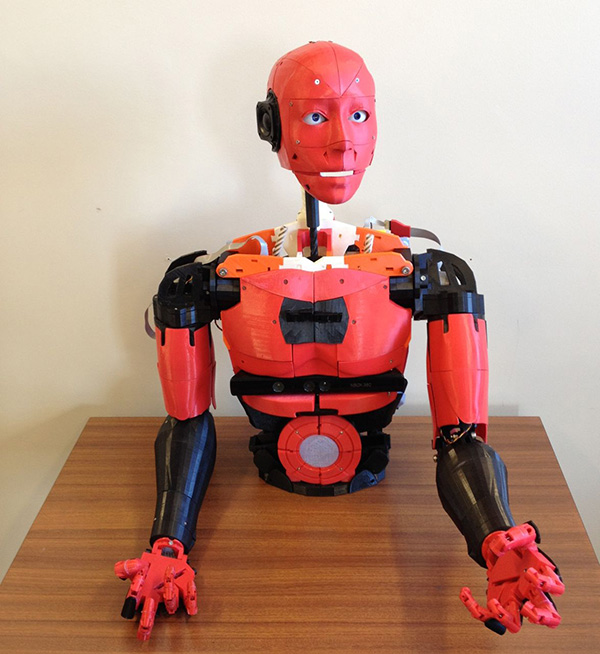
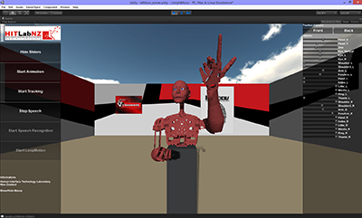

# e-Lab robotics project

e-Lab robotics project, documentation, targets, goals, sub-projects

## summary / goal

Can we train a robot from scratch in the same way we train a human baby? Training is important because it offers examples of behavior that was previously optimized, preventing the young robot from lengthy, costly, potentially dangerous trials-and-errors.
What would it take for this robot to start learning and interacting, imitating other?

Learning a model of the world cannot be based on static pre-defined cost-functions or reward-functions. The robot own goals and capabilities needs to be learned from the ground-up. How do humans learn all this?

Brain: an entity needs to have a brain capable of learning a knowledge graph of the environment it is embedded in. The architecture of this brain is currently unknown, but LLM offers insights because they learn a knowledge graph (on words), albeit not multi-modal and embodied.

Learning: the only possible type of learning in blank-slate robot or young human baby is predictive learning. In the real world there is no ground truth but itself. Prediction forecasts the future, and the future is only a few instants away. When that future is realized, we can estimate the value of our prediction, and its validity.

Learning environment: an entity needs a stimulating environment embedded with trainers, other agents that have previously learned a task and can show examples, provide feedback. A static environment with just objects is not enough. In robotics the cost of tutoring is prohibitive as it involves humans operating in real time. Automata are not helpful because they cannot provide fine feedback and the agent can only learn as much as the automata: pre-confectioned solutions. Training agents provide feedback with voice, and no-verbal cues like facial expressions and sounds. 

Notes:
Prediction generates “own goals” and a history of our prediction and interaction with the world generates the “idea of self”. Prediction by itself is the core learning of an agent and its history is what defines the agent. The brain need to have enough capacity for storing a lifelong set of experiences.

## environment

We will train the robot in an interactive environment for human-robot-interaction (HRI) or collaborative environemnt.

Examples are:

## References 

http://www.bartneck.de/publications/2015/unity/ 

https://dl.acm.org/doi/10.1145/3597623 

